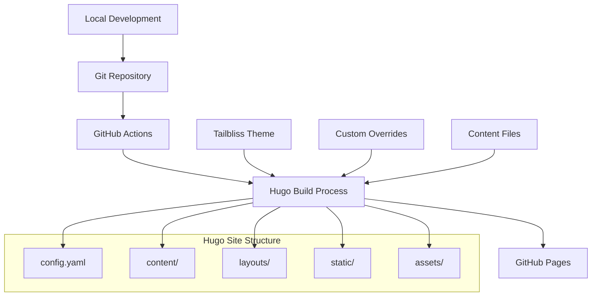

# Design Document

## Overview

This design outlines the architecture for a Hugo static site using the Tailbliss theme, with customization capabilities and automated GitHub Pages deployment. The solution follows Hugo's best practices for theme management, provides a clean separation between theme and customization, and implements a robust CI/CD pipeline.

## Architecture

### High-Level Architecture



### Component Architecture

1. **Hugo Core**: Static site generator engine
2. **Tailbliss Theme**: Base theme providing layouts, styles, and components
3. **Custom Layer**: Project-specific overrides and extensions
4. **Build Pipeline**: GitHub Actions workflow for automated deployment
5. **Content Management**: Markdown files and media assets

## Components and Interfaces

### 1. Hugo Site Structure

```
project-root/
├── config.yaml              # Hugo configuration
├── content/                 # Markdown content files
├── layouts/                 # Custom layout overrides
├── static/                  # Static assets (images, files)
├── assets/                  # Source assets (SCSS, JS)
├── themes/tailbliss/        # Theme as Git submodule
├── package.json             # Node.js dependencies
├── tailwind.config.js       # Tailwind CSS configuration
└── .github/workflows/       # GitHub Actions workflows
```

### 2. Theme Integration Strategy

**Git Submodule Approach:**
- Add Tailbliss theme as a Git submodule in `themes/tailbliss/`
- Allows theme updates while maintaining version control
- Enables easy theme switching if needed

**Configuration Override:**
- Use `config.yaml` to override theme defaults
- Implement custom parameters for project-specific settings
- Maintain theme compatibility through proper configuration structure

### 3. Customization Layer

**Layout Overrides:**
- Place custom layouts in `layouts/` directory
- Hugo's lookup order prioritizes local layouts over theme layouts
- Maintain theme structure for easy updates

**Asset Pipeline:**
- Custom CSS/SCSS in `assets/css/`
- Custom JavaScript in `assets/js/`
- Use Hugo Pipes for asset processing and optimization

**Content Structure:**
- Organize content by type (posts, pages, projects)
- Use front matter templates for consistent metadata
- Implement custom content types as needed

## Data Models

### Site Configuration Model

```yaml
baseURL: 'https://username.github.io/repository-name'
languageCode: 'en-us'
title: 'Project Title'
theme: 'tailbliss'

params:
  # Custom parameters
  brand:
    name: 'Project Name'
    logo: '/images/logo.png'
  social:
    github: 'username'
    twitter: 'handle'
  features:
    darkMode: true
    search: true

menu:
  main:
    - name: 'Home'
      url: '/'
      weight: 1
    - name: 'About'
      url: '/about/'
      weight: 2
```

### Content Front Matter Model

```yaml
---
title: "Page Title"
date: 2024-01-01T00:00:00Z
draft: false
description: "Page description for SEO"
tags: ["tag1", "tag2"]
categories: ["category"]
featured_image: "/images/featured.jpg"
---
```

## Error Handling

### Build Process Error Handling

1. **Hugo Build Errors:**
   - Validate configuration syntax before build
   - Check for missing templates or partials
   - Verify content front matter structure

2. **Theme Integration Errors:**
   - Validate theme submodule initialization
   - Check theme compatibility with Hugo version
   - Handle missing theme dependencies

3. **Deployment Errors:**
   - GitHub Actions workflow error reporting
   - Build log accessibility for debugging
   - Rollback mechanism for failed deployments

### Development Environment Error Handling

1. **Local Development:**
   - Clear error messages for configuration issues
   - Hot reload error recovery
   - Asset compilation error reporting

2. **Content Validation:**
   - Front matter validation
   - Broken link detection
   - Image optimization warnings

## Testing Strategy

### 1. Local Testing

- **Development Server:** Use `hugo server` with live reload
- **Build Validation:** Test `hugo build` locally before deployment
- **Cross-browser Testing:** Verify responsive design across devices
- **Performance Testing:** Lighthouse audits for optimization

### 2. Automated Testing

- **Build Tests:** GitHub Actions workflow validates successful builds
- **Link Checking:** Automated broken link detection
- **HTML Validation:** W3C markup validation in CI pipeline
- **Performance Monitoring:** Core Web Vitals tracking

### 3. Content Testing

- **Front Matter Validation:** Ensure consistent metadata structure
- **Image Optimization:** Verify image compression and formats
- **SEO Validation:** Meta tags and structured data verification

## Deployment Strategy

### GitHub Actions Workflow

```yaml
name: Deploy Hugo Site
on:
  push:
    branches: [ main ]
  pull_request:
    branches: [ main ]

jobs:
  build-and-deploy:
    runs-on: ubuntu-latest
    steps:
      - name: Checkout
        uses: actions/checkout@v4
        with:
          submodules: recursive
          
      - name: Setup Hugo
        uses: peaceiris/actions-hugo@v2
        with:
          hugo-version: 'latest'
          extended: true
          
      - name: Setup Node.js
        uses: actions/setup-node@v4
        with:
          node-version: '18'
          
      - name: Install dependencies
        run: npm ci
        
      - name: Build
        run: hugo --minify
        
      - name: Deploy
        uses: peaceiris/actions-gh-pages@v3
        if: github.ref == 'refs/heads/main'
        with:
          github_token: ${{ secrets.GITHUB_TOKEN }}
          publish_dir: ./public
```

### GitHub Pages Configuration

- **Source Branch:** `gh-pages` (created by GitHub Actions)
- **Custom Domain:** Optional CNAME configuration
- **HTTPS:** Enforced through GitHub Pages settings
- **Build Source:** GitHub Actions (not Jekyll)

## Security Considerations

1. **Content Security:** Sanitize user-generated content
2. **Asset Security:** Validate and optimize uploaded media
3. **Build Security:** Pin dependency versions in package.json
4. **Deployment Security:** Use GitHub's built-in security features

## Performance Optimization

1. **Asset Optimization:**
   - Image compression and modern formats (WebP)
   - CSS and JavaScript minification
   - Font optimization and preloading

2. **Build Optimization:**
   - Hugo's built-in minification
   - Asset bundling and tree shaking
   - Critical CSS inlining

3. **Delivery Optimization:**
   - GitHub Pages CDN utilization
   - Proper caching headers
   - Lazy loading for images and content